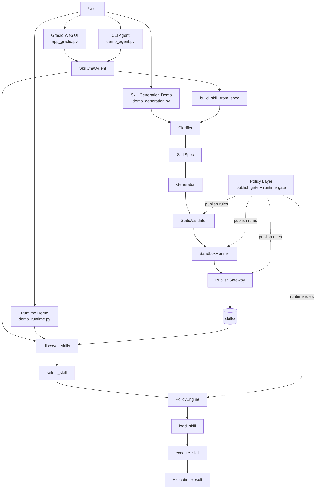
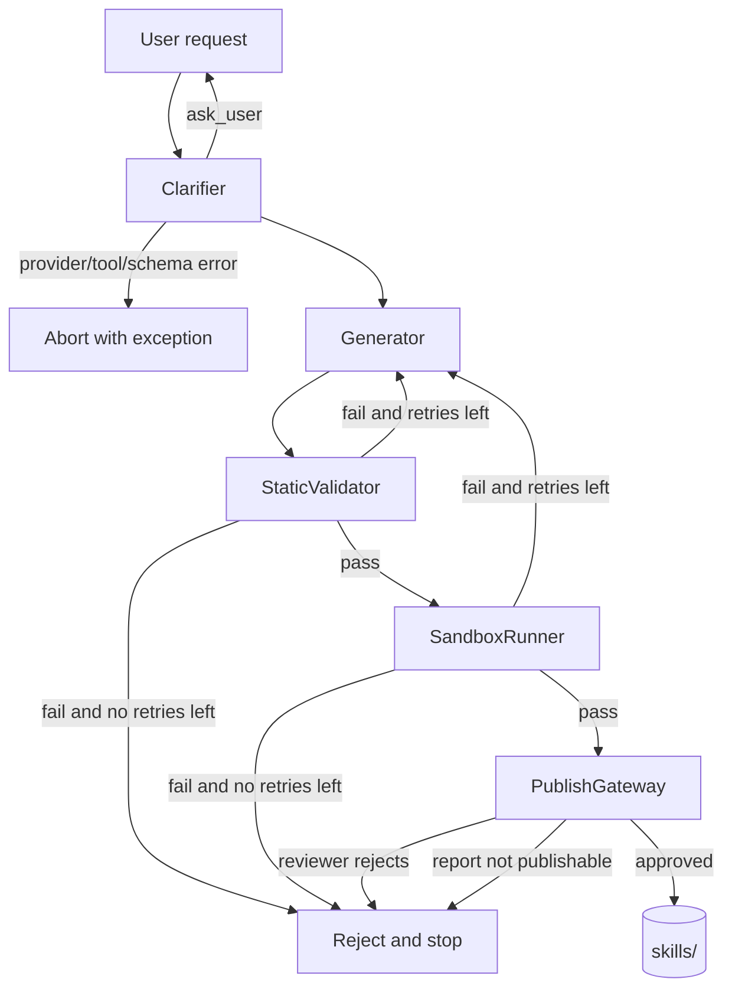
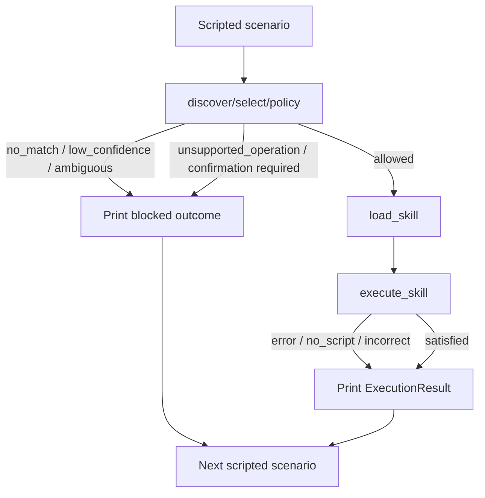
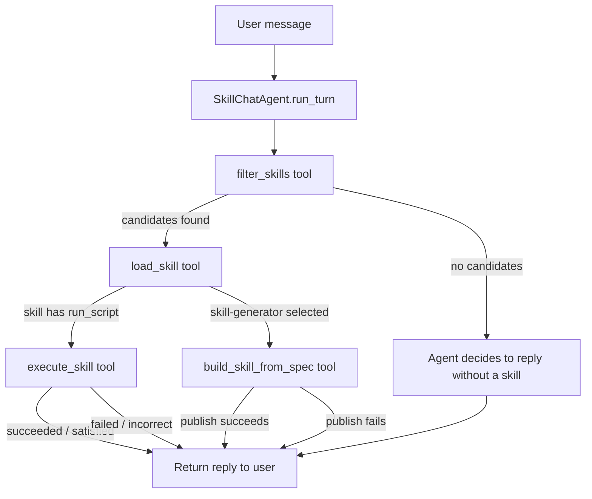

# Architecture

This document describes the current `skill-agent` architecture from high level down to module level.

See also:

- [policy.md](./policy.md) for the decision rules applied on top of this structure
- [validation.md](./validation.md) for publish-time checks
- [schema.md](./schema.md) for the data contracts moving between layers
- [skill.md](./skill.md) for the skill artifact layout consumed by the system

The system has four user-facing entrypoints:

1. `app_gradio.py` — Gradio web UI wrapping the full agent (primary demo)
2. `demo_agent.py` — CLI multi-turn chat agent
3. `demo_generation.py` — skill generation pipeline (CLI)
4. `demo_runtime.py` — scripted runtime policy scenarios (CLI)

## 1. System View

The diagram below shows the primary success path only. Failure routing is broken out explicitly in the next section.



At a high level:

- `app_gradio.py` is the primary demo: a web UI running the multi-turn `SkillChatAgent`
- `demo_agent.py` is the same agent in a CLI chat loop
- `demo_generation.py` runs the standalone clarify → generate → validate → sandbox → publish pipeline
- `demo_runtime.py` runs predefined scripted scenarios against existing skills
- `Policy Layer` is a cross-cutting control layer, not a separate user-facing entrypoint
- `skills/` is the shared boundary between generation and runtime

## 2. Policy In The Architecture

Yes, policy belongs in the architecture view, because the system is not just "generate then run".

Policy decides:

- whether a generated skill is publishable
- whether a discovered skill is allowed to execute
- how blocked, rejected, and failed paths are classified

In this repo, policy appears in two places:

### 2.1 Publish-Time Policy Surface

Publish-time policy is distributed across:

- `StaticValidator`
- `SandboxRunner`
- `PublishGateway`

This is the part that decides whether a generated artifact may cross the boundary into `skills/`.

### 2.2 Runtime Policy Surface

Runtime policy is centered on:

- `select_skill()`
- `check_capability()`
- `PolicyEngine`

This is the part that decides whether a discovered skill may cross the boundary into actual execution.

### 2.3 Why It Should Stay High-Level Here

`architecture.md` should show where policy acts.

`policy.md` should define the detailed rules.

That separation keeps the big picture readable:

- architecture answers "where does policy sit?"
- policy answers "what rules does it enforce?"

## 3. Failure Routing Overview

This is the missing part that matters operationally: where each failure actually goes.

### 3.1 Skill Generation Demo Failure Routing



What this means in code:

- clarification failure does not auto-recover; it bubbles up as an exception
- static validation failure loops back to `Generator` while retries remain
- sandbox failure also loops back to `Generator` while retries remain
- after retry budget is exhausted, the pipeline stops in a rejected state
- reviewer rejection is terminal for that run; it does not auto-regenerate

### 3.2 Runtime Demo Failure Routing



What this means in code:

- runtime failures do not go back into generation
- blocked scenarios are logged and the demo moves to the next scenario
- execution errors are reported as `ExecutionResult`, then the demo continues

### 3.3 Agent / Gradio Turn Failure Routing



What this means in code:

- the agent never surfaces raw exceptions to the user — errors become part of the reply text
- if no skill matches, the agent answers from its own knowledge
- if `skill-generator` is selected, the agent triggers the full generation pipeline inline
- execution failures are reported back to the user as part of the assistant turn

## 4. User-Facing Modes

### 4.1 Gradio Web UI (primary demo)

Entry point:

- `uv run python app_gradio.py`

Purpose:

- multi-turn chat interface backed by `SkillChatAgent`
- includes a Turn Inspector panel showing raw model and tool events per turn
- supports skill generation inline (via `skill-generator` skill)

User experience:

- open `http://localhost:7860` in a browser
- left panel: chat; right panel: trace/debug inspector
- `--docker` flag switches to `DockerSandboxRunner` for skill generation tests
- a single shared agent instance is created at startup (single-tenant)

### 4.2 CLI Agent

Entry point:

- `uv run python demo_agent.py`

Purpose:

- same `SkillChatAgent` as the Gradio UI, exposed as a terminal chat loop
- useful for scripted testing and debugging without a browser

User experience:

- multi-turn REPL in the terminal
- `--verbose` prints model/tool loop steps
- `--docker` flag for `DockerSandboxRunner`
- agent workspace writes go to `vault/agent-demo/`

### 4.3 Skill Generation Demo

Entry point:

- `uv run python demo_generation.py`

Purpose:

- run the standalone clarify → generate → validate → sandbox → publish pipeline
- useful for testing skill generation in isolation

User experience:

- interactive prompts by default
- CLI flags for non-interactive input (`--name`, `--description`, `--sample-input`, etc.)
- `--no-review` skips the manual approval prompt before publish
- up to three generation/repair attempts

### 4.4 Runtime Demo

Entry point:

- `uv run python demo_runtime.py`

Purpose:

- run predefined scripted scenarios against skills already in `skills/`
- shows policy logs, selection behavior, execution status, and task outcome

User experience:

- deterministic scenarios with happy paths and failure paths
- useful for validating runtime policy behavior end to end
- output from file-writing skills is routed to `vault/runtime-demo/scripted/`

## 5. Shared Layers

### Layer 2: Orchestration

- `run_pipeline()` in `demo_generation.py` coordinates clarify → generate → validate → sandbox → publish
- `SkillChatAgent.run_turn()` in `src/skill_agent/agent.py` drives the multi-turn agent loop
- `PolicyEngine` in `src/skill_agent/runtime/policy.py` coordinates selection → capability → execution gating

### Layer 3: Core Services

Build plane:

- `Clarifier`
- `Generator`
- `StaticValidator`
- `SandboxRunner`
- `PublishGateway`

Runtime plane:

- `discover_skills`
- `select_skill`
- `check_capability`
- `load_skill`
- `execute_skill`

### Layer 4: Shared Contracts

Defined mainly in [schema.md](./schema.md) and `src/skill_agent/models.py`:

- `SkillRequest`
- `SkillSpec`
- `GeneratedSkill`
- `ValidationReport`
- `PublishResult`
- `SkillStub`
- `PolicyDecision`
- `ExecutionResult`

### Layer 5: Filesystem Artifacts

- `skills/<skill-id>/SKILL.md`
- `skills/<skill-id>/scripts/run.py`
- optional `references/` and `assets/`
- `vault/runtime-demo/` for demo output produced by file-writing skills

## 6. Skill Generation Demo Internals

The skill generation demo exists to transform a vague request into a skill package that can be published under `skills/`.

### 6.1 Request Ingestion

`demo_generation.py` collects:

- `skill_name`
- `skill_description`
- sample inputs
- expected outputs
- constraints
- runtime preference

This becomes `SkillRequest`.

### 6.2 Clarification

`src/skill_agent/clarifier.py` turns `SkillRequest` into `SkillSpec`.

Design:

- uses `AgentLoop`
- exposes `ask_user` and `submit_spec` to the model

Responsibility:

- normalize the request
- fill required fields for generation
- ask focused follow-up questions when needed

### 6.3 Generation

`src/skill_agent/generator.py` turns `SkillSpec` into `GeneratedSkill`.

Design:

- also uses `AgentLoop`
- uses a `SkillBuilder` accumulator
- exposes `set_metadata`, `write_file`, and `add_test_case` to the model

Responsibility:

- build metadata
- write `SKILL.md`
- write `scripts/run.py`
- optionally add `references/` or `assets/`
- attach execution tests

### 6.4 Static Validation

`src/skill_agent/validator.py` checks the generated artifact before execution.

Validation domains:

- syntax
- metadata consistency
- activation quality
- capability metadata completeness

Key rule:

- a skill may look structurally valid but still fail publication if `domain` or `supported_actions` is missing

### 6.5 Sandbox Execution

`src/skill_agent/sandbox.py` executes generated tests in a temporary directory.

Current behavior:

- materializes the skill into a temp folder
- runs `python scripts/run.py`
- writes test fixtures before each case
- supports `string_match`, `contains`, `regex`, and `manual`
- reuses one temp workspace across sequential test cases

### 6.6 Publish Gate

`src/skill_agent/publisher.py` is the final gate.

If publish succeeds:

- skill files are written to `skills/<skill-name>/`
- `SKILL.md` status is rewritten to `published`

If publish fails:

- nothing is written
- `PublishResult.message` carries the rejection reason

### 6.7 Build Retry Loop

`demo_generation.py` allows up to three generation attempts.

Feedback loop:

- static validator errors go back into the generator
- sandbox failures also go back, with extra environment context

This is the main self-repair mechanism in the current implementation.

## 7. Runtime Internals

Both runtime modes consume skills already stored on disk.

### 7.1 Shared Runtime Pipeline

`demo_runtime.py` and `SkillChatAgent` share the same core runtime primitives:

```text
discover -> select -> capability -> policy gate -> load -> execute
```

The difference is in how input is supplied and how results are surfaced:

- `demo_runtime.py` uses predefined scripted scenarios
- `SkillChatAgent` (used by `demo_agent.py` and `app_gradio.py`) drives the pipeline through LLM tool calls

### 7.2 Discovery

`src/skill_agent/runtime/discovery.py` scans `skills/` and parses YAML frontmatter from each `SKILL.md`.

Output:

- `SkillStub`

Purpose:

- keep discovery cheap
- avoid loading full runtime content until selection succeeds

### 7.3 Selection

`src/skill_agent/runtime/selector.py` ranks skills by lexical token overlap.

Inputs:

- request text
- skill name
- skill description
- optional requested action

Output:

- selected stub or `None`
- `SelectionStatus`
- structured logs

### 7.4 Capability Gate

`src/skill_agent/runtime/capability.py` enforces:

- `supported_actions`
- `forbidden_actions`

Key policy:

- undeclared action is treated conservatively
- forbidden action always wins

### 7.5 Execution Gate

`src/skill_agent/runtime/policy.py` applies the runtime policy.

Default deny-by-confirmation actions:

- `delete`
- `overwrite`
- `network`

So a skill may be:

- selected successfully
- capability-supported
- but still blocked from execution

### 7.6 Load and Execute

`src/skill_agent/runtime/loader.py` and `src/skill_agent/runtime/executor.py` perform the final step.

Load:

- read `SKILL.md`
- locate `scripts/run.py`

Execute:

- run `python <script>`
- pass payload via `stdin`
- capture `stdout`, `stderr`, exit code
- optionally validate output against expected output
- optionally run inside a dedicated `cwd`

For demo cleanliness:

- scripted runtime demo writes into `vault/runtime-demo/scripted/`
- interactive runtime mode writes into `vault/runtime-demo/interactive/`

## 8. Data Flow

### Skill Generation Demo Data Flow

```text
SkillRequest
  -> SkillSpec
  -> GeneratedSkill
  -> ValidationReport
  -> PublishResult
```

### Runtime Demo and Interactive Data Flow

```text
skills/*/SKILL.md
  -> SkillStub
  -> PolicyDecision
  -> LoadedSkill
  -> ExecutionResult
```

## 9. Module Map

### Top-level scripts

- `app_gradio.py`: Gradio web UI (primary demo)
- `demo_agent.py`: CLI multi-turn chat agent
- `demo_generation.py`: build pipeline orchestration
- `demo_runtime.py`: scripted runtime demo

### Build modules

- `src/skill_agent/clarifier.py`
- `src/skill_agent/generator.py`
- `src/skill_agent/validator.py`
- `src/skill_agent/sandbox/` (local and Docker runners)
- `src/skill_agent/publisher.py`

### Agent

- `src/skill_agent/agent.py`

### Shared infrastructure

- `src/skill_agent/models.py`
- `src/skill_agent/loop.py`
- `src/skill_agent/provider.py`
- `src/skill_agent/logging_utils.py`
- `src/skill_agent/sanitize.py`
- `src/skill_agent/tool.py`

### Runtime modules

- `src/skill_agent/runtime/discovery.py`
- `src/skill_agent/runtime/selector.py`
- `src/skill_agent/runtime/capability.py`
- `src/skill_agent/runtime/policy.py`
- `src/skill_agent/runtime/loader.py`
- `src/skill_agent/runtime/executor.py`
- `src/skill_agent/runtime/models.py`

## 10. Control Boundaries

There are three practical boundaries in the current architecture:

### LLM boundary

Everything before `GeneratedSkill` may depend on an LLM provider.

Files:

- `clarifier.py`
- `generator.py`
- `provider.py`
- `loop.py`

### Validation boundary

`GeneratedSkill` is not trusted until:

- static validation passes
- sandbox execution passes

### Runtime boundary

The runtime trusts only published skill files on disk plus runtime policy checks.

It does not reuse build-time internal objects such as `SkillSpec`.

## 11. Current Constraints

Important architecture constraints today:

- the runtime only executes Python scripts
- selection is lexical, not semantic
- the sandbox is local temp-dir execution, not container isolation
- regression validation is stubbed
- discovery depends only on `SKILL.md` frontmatter
- runtime does not interpret the markdown body semantically

## 12. Mental Model

If you want one short summary of the repo, it is this:

- `app_gradio.py` is the primary demo — a web UI running the full multi-turn agent
- `demo_agent.py` is the same agent as a CLI chat loop
- `demo_generation.py` is the standalone skill generation pipeline
- `demo_runtime.py` is the scripted runtime policy demo
- `skills/` stores the shared skill artifacts
- `docs/` explains the contract and design decisions
- `tests/` lock in the current behavior

That is the current high-to-low architecture of `skill-agent`.
