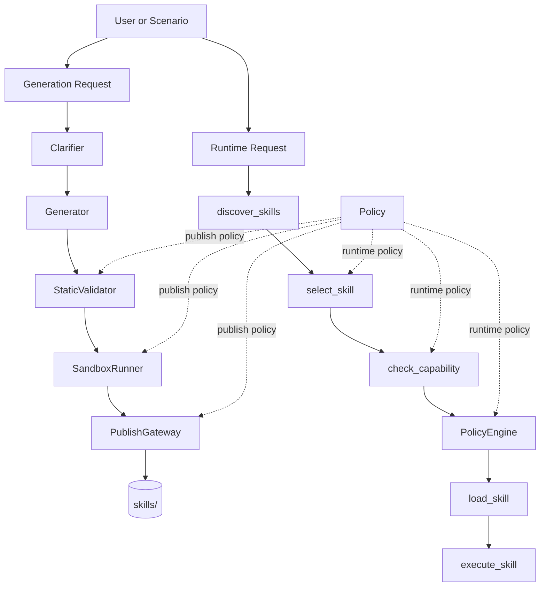
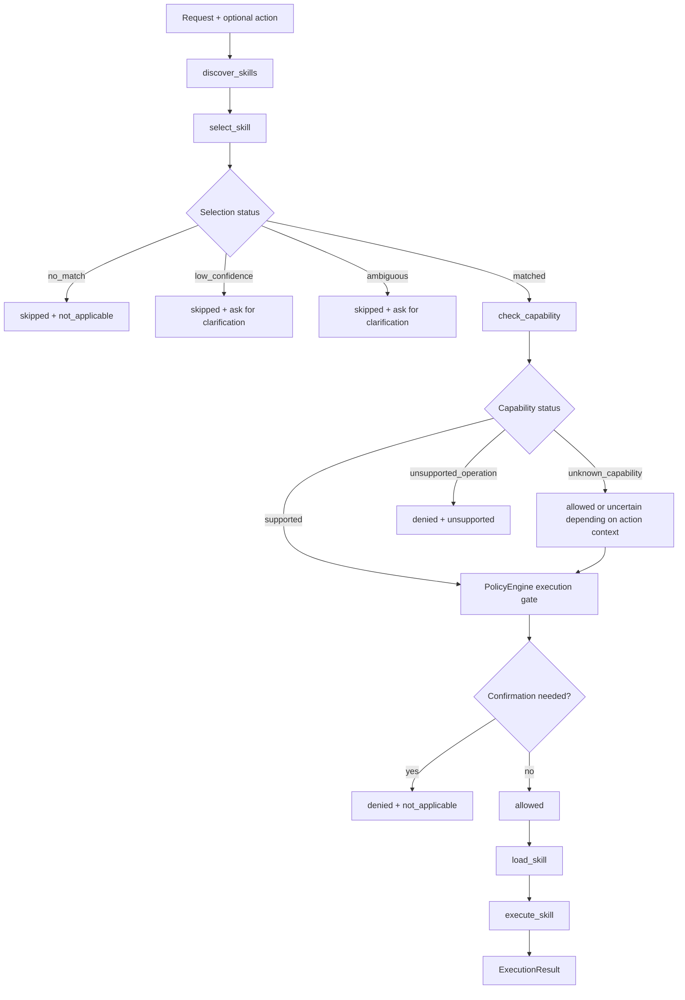
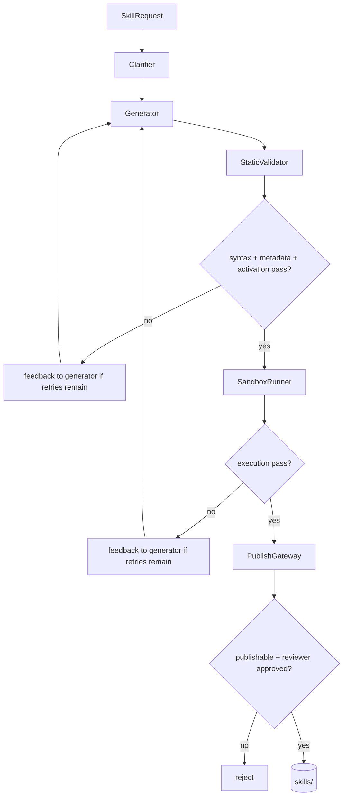

# Runtime and Publish Policy

This document describes the policy behavior that is implemented in the repo today.

It covers two separate but related flows:

- runtime policy in `src/skill_agent/runtime/`
- publish gating in `demo_generation.py`, `validator.py`, `sandbox/`, and `publisher.py`

See also:

- [status.md](./status.md) for implemented vs partial vs TODO status labels
- [architecture.md](./architecture.md) for where policy sits in the overall system
- [validation.md](./validation.md) for the concrete validator and sandbox checks
- [schema.md](./schema.md) for the status models and report shapes
- [skill.md](./skill.md) for the metadata fields policy consumes

## Policy Placement



The important architectural point is that policy is not a single file or single function.

It is a control layer applied at:

- publish time through validator + sandbox + publish gate
- runtime through selection + capability + execution gate

## Runtime Decision Flow



In the current implementation:

- `no_match`, `low_confidence`, and `ambiguous` stop before load/execute
- `unsupported_operation` stops before load/execute
- confirmation-gated actions such as `delete` also stop before load/execute
- allowed requests continue into `load_skill()` and `execute_skill()`

## Scope

Policy v1 in this repository assumes:

- local skill directories under `skills/`
- local execution through `python scripts/run.py`
- explicit capability metadata in `SKILL.md` frontmatter
- small, inspectable rules instead of a generic policy framework

It does not currently provide:

- semantic retrieval
- container isolation
- per-side-effect sandbox permissions
- multi-skill orchestration
- policy-driven human review routing from `ValidationPolicy.review`

## Validation Policy Config Status

The repo now has a real YAML-backed validation policy in:

- `policies/mvp-safe.yaml`
- `src/skill_agent/validation/policy.py`

That policy is only partially wired today.

Sections consumed by validation code:

- `dependencies`
- `activation`
- `capability`
- `code_safety`

Sections defined in schema/config but not enforced yet:

- `package`
- `prompt_eval`
- `review`

That distinction matters when reading `mvp-safe.yaml`: some sections describe real validation behavior today, while others are placeholders for future workflow or package-policy work.

## Publish Decision Flow



This is the publish-side policy in one picture:

- static validation enforces structural and metadata rules
- sandbox execution enforces runnable behavior
- publish gateway enforces final accept/reject semantics

## 1. Selection Policy

Skill selection is implemented in `src/skill_agent/runtime/selector.py`.

### Inputs

Selection uses:

- the user request text
- each skill's `name`
- each skill's `description`
- an optional `requested_action`

### Tokenization

The selector tokenizes text with:

```text
[a-z]+
```

That means selection is purely lexical and case-insensitive.

### Scoring

Each candidate gets a score equal to:

```text
len(request_tokens intersect candidate_tokens)
```

The default config in `SelectionConfig` is:

```text
min_score = 1
low_confidence_threshold = 2
ambiguity_margin = 1
```

### Forbidden-Action Pre-Filter

If `requested_action` is present, the selector first removes candidates that explicitly forbid that action, as long as at least one eligible candidate remains.

This is only a ranking optimization. Capability checks still run later.

### Selection Outcomes

The selector returns one of:

- `matched`
- `low_confidence`
- `ambiguous`
- `no_match`

Rules:

- best score `< min_score` -> `no_match`
- best score `< low_confidence_threshold` -> `low_confidence`
- top two scores both `>= low_confidence_threshold` and within `ambiguity_margin` -> `ambiguous`
- otherwise -> `matched`

### Runtime Consequences

`PolicyEngine.evaluate()` handles selection outcomes conservatively:

- `no_match` -> execution skipped
- `low_confidence` -> execution skipped and user clarification is recommended
- `ambiguous` -> execution skipped and user clarification is recommended
- `matched` -> continue to capability checks

## 2. Capability Policy

Capability checks are implemented in `src/skill_agent/runtime/capability.py`.

### Required Metadata

For a skill to be publishable in this repo, it should declare:

- `domain`
- `supported_actions`
- `forbidden_actions`
- `side_effects`

At runtime, the important fields are `supported_actions` and `forbidden_actions`.

### Rules

Capability evaluation for a requested action follows this order:

1. empty action -> `unknown_capability`
2. no `supported_actions` and no `domain` -> `unknown_capability`
3. action in `forbidden_actions` -> `unsupported_operation`
4. action in `supported_actions` -> `supported`
5. `supported_actions` exists but action missing -> `unsupported_operation`
6. only `domain` exists -> `unknown_capability`

### Important Detail

`domain` is not enough to authorize execution.

Example:

- request mentions Obsidian
- selected skill has `domain: [obsidian]`
- requested action is `delete`
- skill does not declare `delete` in `supported_actions`

Result:

- capability -> `unsupported_operation`
- execution -> denied

### Enum Values vs Actual Emissions

`CapabilityStatus` includes:

- `supported`
- `unsupported_operation`
- `unsupported_domain`
- `unknown_capability`

The current checker emits everything except `unsupported_domain`. That value is reserved for future expansion.

## 3. Execution Gate

Execution gating is handled in `PolicyEngine`.

### Confirmation List

The default `PolicyConfig` requires confirmation for:

- `delete`
- `overwrite`
- `network`

If the requested action matches one of those values, the policy engine returns:

- `execution_status = denied`
- `task_status = not_applicable`

This happens even if the skill otherwise supports the action.

### Allowed Execution

If selection and capability checks pass, and the action is not in the confirmation list, the engine returns:

- `execution_status = allowed`
- `task_status = unknown`

That means the runtime is allowed to load and execute the skill.

## 4. Skill Loading and Execution

Skill loading and execution live in:

- `loader.py`
- `executor.py`

### Loading Rules

`load_skill()`:

- reads `SKILL.md`
- looks for `scripts/run.py`
- does not inspect alternate entrypoints

### Execution Rules

`execute_skill()`:

- launches `python <run_script>`
- passes the user payload on `stdin`
- captures `stdout`, `stderr`, and exit code
- times out after 30 seconds

### Execution Result Separation

The runtime deliberately separates low-level execution success from task success.

Examples:

- script exits `0`, expected output matches -> `execution_status = succeeded`, `task_status = satisfied`
- script exits `0`, expected output does not match -> `execution_status = succeeded`, `task_status = incorrect`
- script exits non-zero -> `execution_status = failed`, `task_status = unknown`
- no run script -> `execution_status = skipped`, `task_status = not_applicable`

This distinction is one of the main policy design goals in the repo.

## 5. Publish Policy

Publish gating is stricter than runtime discovery.

The publish path in `demo_generation.py` (and inline via `SkillChatAgent.build_skill_from_spec`) is:

1. clarify request
2. generate skill
3. static validate
4. sandbox execute tests
5. optional manual review
6. publish or reject

### Retry Policy

Generation is retried up to three times.

Repair loop:

- static validation errors are fed back into the generator
- sandbox failures are wrapped with extra environment context and fed back into the generator
- if all attempts fail, publishing is rejected

### Publish Requirements

A skill is published only if:

- syntax validation passes
- metadata validation passes
- activation validation passes
- code safety validation passes
- sandbox execution passes
- `report.errors` is empty
- reviewer does not reject it, when review is enabled

Current review implementations:

- `demo_generation.py` can block on a synchronous manual reviewer callback
- `SkillChatAgent` + `app_gradio.py` can pause after automated checks and wait for approve/reject/needs changes

What is not implemented yet:

- deriving review requirements from `ValidationPolicy.review`
- persistent review state or durable pending actions
- a generic workflow runtime that resumes paused publish flows

### Publish Side Effect

On success, the publisher writes the skill to disk and rewrites `SKILL.md` so that:

```yaml
status: published
```

## 6. Status Model

The project uses four layers of status:

### Selection status

- `matched`
- `low_confidence`
- `ambiguous`
- `no_match`

### Capability status

- `supported`
- `unsupported_operation`
- `unsupported_domain`
- `unknown_capability`

### Execution status

- `allowed`
- `denied`
- `skipped`
- `succeeded`
- `failed`

### Task status

- `satisfied`
- `unsupported`
- `incorrect`
- `not_applicable`
- `unknown`

The code intentionally does not collapse these into a single success/failure bit.

## 7. Examples Mapped to the Current Repo

### Supported create request

Using `obsidian-note-writer`:

- request: "create an obsidian markdown note"
- action: `create`
- outcome: `matched` -> `supported` -> `allowed`

### Unsupported delete request

Using `obsidian-note-writer`:

- request: "delete a note from the obsidian vault"
- action: `delete`
- outcome: `matched` -> `unsupported_operation` -> `denied`

### Supported but confirmation-gated delete request

Using `obsidian-crud` with default config:

- request: "delete vault files"
- action: `delete`
- capability: `supported`
- execution: `denied`

The denial reason is not lack of capability. It is the confirmation requirement.

### Weak or unrelated request

- request: "deploy kubernetes cluster to production"
- outcome: usually `no_match`, sometimes `low_confidence`
- execution: `skipped`

## 8. What Is Reserved for Later

These concepts exist in the docs or enums but are not fully implemented:

- true domain-based denial
- side-effect-specific execution controls
- network sandboxing
- multi-runtime execution
- regression comparison against previous skill versions
- automatic confirmation workflow that resumes execution after approval
- policy-driven review requirements from YAML config
- durable workflow state / pending-action persistence

## Summary

The implemented policy is intentionally small:

- lexical selection
- explicit capability checks
- a short confirmation deny-list
- separate execution and task outcomes
- publish gating through validator + sandbox + optional review

That keeps the demo easy to inspect and easy to test, while still blocking the most obviously wrong executions.
